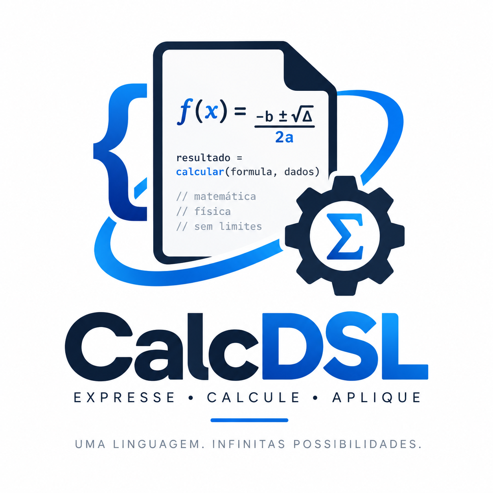

<div align="center">



# DSL de Cálculos Matemáticos e Físicos

</div>

Uma **Domain-Specific Language (DSL)** para definição, validação e execução de fórmulas matemáticas e físicas, desenvolvida como projeto de estudo e experimentação em **Kotlin**, **ANTLR**, linguagens formais e arquitetura de software.

O objetivo do projeto é explorar como fórmulas podem ser representadas como uma linguagem própria, separando a **definição do cálculo** da **implementação do sistema responsável por executá-lo**.

---

## 📌 Visão geral

Em muitos sistemas, regras de cálculo acabam implementadas diretamente no código-fonte:

```text
resultado = valor * taxa + adicional
```

Quando uma fórmula muda, normalmente é necessário alterar código, executar testes, gerar uma nova versão da aplicação e realizar um novo deploy.

A proposta deste projeto é investigar uma abordagem diferente:

```text
Fórmula
   ↓
DSL
   ↓
Análise da linguagem
   ↓
Representação do cálculo
   ↓
Validação
   ↓
Execução
   ↓
Resultado
```

A fórmula passa a ser tratada como **dado e linguagem**, enquanto o sistema fornece a infraestrutura necessária para interpretá-la e executá-la.

---

# 🎯 Objetivo

Construir uma DSL capaz de representar diferentes tipos de cálculos utilizando uma sintaxe controlada e independente da linguagem utilizada pela aplicação cliente.

Exemplo conceitual:

```text
preco * quantidade
```

ou:

```text
(valor + taxa) / parcelas
```

O objetivo não é apenas construir uma calculadora.

O projeto serve como laboratório para estudar conceitos relacionados a:

* Domain-Specific Languages;
* compiladores e interpretadores;
* análise léxica;
* análise sintática;
* gramáticas formais;
* Abstract Syntax Tree (AST);
* validação semântica;
* avaliação de expressões;
* arquitetura de software;
* modelagem de fórmulas;
* cálculos encadeados;
* extensibilidade de linguagens.

---

# 💡 Motivação

Sistemas corporativos frequentemente possuem cálculos espalhados por diferentes partes da aplicação.

Esses cálculos podem representar, por exemplo:

* preços;
* tarifas;
* taxas;
* impostos;
* descontos;
* rentabilidade;
* parcelamento;
* indicadores;
* regras financeiras;
* fórmulas matemáticas;
* fórmulas físicas.

Uma fórmula relativamente simples pode depender de diferentes tipos de informação.

Considere:

```text
valorFinal = valorEntrada * taxa + custoOperacional
```

Nesse cenário:

* `valorEntrada` pode chegar através de uma requisição;
* `taxa` pode ser uma configuração persistida;
* `custoOperacional` pode ser resultado de outro cálculo;
* `valorFinal` representa o resultado da fórmula.

Isso cria a necessidade de diferenciar **a fórmula** dos **valores utilizados durante sua execução**.

A DSL procura explorar justamente essa separação.

---

# 🧠 Conceito central

Uma fórmula deve descrever **como um cálculo é realizado**, e não necessariamente de onde cada valor será obtido.

Por exemplo:

```text
base * altura
```

A fórmula conhece apenas as variáveis necessárias.

Durante a execução, um contexto fornece seus respectivos valores:

```text
base = 10
altura = 5
```

Produzindo:

```text
50
```

Essa separação permite que a mesma fórmula seja executada diversas vezes utilizando diferentes conjuntos de dados.

---

# 🔄 Fluxo conceitual da DSL

O processamento de uma fórmula pode ser representado da seguinte maneira:

```text
                    ┌──────────────────┐
                    │     Fórmula      │
                    │  (texto da DSL)  │
                    └────────┬─────────┘
                             │
                             ▼
                    ┌──────────────────┐
                    │      Lexer       │
                    │ análise léxica   │
                    └────────┬─────────┘
                             │
                             ▼
                    ┌──────────────────┐
                    │      Parser      │
                    │ análise sintática│
                    └────────┬─────────┘
                             │
                             ▼
                    ┌──────────────────┐
                    │       AST        │
                    │ representação    │
                    │ da expressão     │
                    └────────┬─────────┘
                             │
                             ▼
                    ┌──────────────────┐
                    │    Validação     │
                    │    semântica     │
                    └────────┬─────────┘
                             │
                             ▼
                    ┌──────────────────┐
                    │ Motor de Cálculo │
                    │    execução      │
                    └────────┬─────────┘
                             │
                             ▼
                    ┌──────────────────┐
                    │    Resultado     │
                    └──────────────────┘
```

Cada etapa possui uma responsabilidade diferente dentro do processamento da linguagem.

---

# 🧩 Fórmulas como dados

Um dos conceitos explorados pelo projeto é a possibilidade de armazenar fórmulas independentemente do código da aplicação.

Conceitualmente, uma definição poderia possuir informações como:

```json
{
  "nome": "areaRetangulo",
  "formula": "base * altura"
}
```

Os valores necessários para executar a fórmula poderiam ser fornecidos separadamente:

```json
{
  "base": 10,
  "altura": 5
}
```

Produzindo:

```json
{
  "resultado": 50
}
```

O formato definitivo de integração e persistência faz parte da evolução arquitetural do projeto.

---

# 🔢 Tipos de valores

A arquitetura da DSL considera diferentes origens possíveis para os valores utilizados nas fórmulas.

## Valores de entrada

Valores recebidos no momento da execução.

Exemplo:

```text
valorCompra
quantidade
peso
distancia
```

---

## Valores configurados

Valores previamente conhecidos pelo sistema.

Exemplo:

```text
taxa
percentual
coeficiente
limite
```

---

## Constantes

Valores que representam constantes matemáticas ou físicas.

Exemplos conceituais:

```text
PI
E
GRAVIDADE
```

---

## Resultados de outros cálculos

Uma fórmula também poderá utilizar o resultado produzido por outra fórmula.

Por exemplo:

```text
calculoA = base * altura

calculoB = calculoA * fator
```

Esse modelo abre espaço para a criação de **cálculos encadeados** e, futuramente, estruturas mais complexas de dependência entre fórmulas.

---

# 🔗 Cálculos encadeados

Um dos objetivos de evolução da DSL é permitir que cálculos sejam organizados como dependências.

Exemplo:

```text
A = x + y
B = A * taxa
C = B / quantidade
```

Conceitualmente:

```text
x ───┐
     ├──► A ───► B ───► C
y ───┘          ▲
                │
              taxa
```

Nesse cenário, o motor precisa compreender a ordem necessária para execução das fórmulas.

Esse conceito permitirá representar processos de cálculo semelhantes aos encontrados em planilhas e sistemas corporativos.

---

# 🧮 Possíveis domínios de aplicação

A DSL foi pensada para evoluir além de operações aritméticas básicas.

## Matemática básica

```text
a + b
a - b
a * b
a / b
```

---

## Geometria

Área de um retângulo:

```text
base * altura
```

Área de um triângulo:

```text
(base * altura) / 2
```

Área de um círculo:

```text
PI * raio ^ 2
```

---

## Álgebra

Equações e expressões algébricas poderão utilizar diferentes variáveis e operadores.

Um exemplo de domínio futuro é a resolução de equações quadráticas.

---

## Trigonometria

A evolução da linguagem poderá incorporar funções como:

```text
sin(angulo)
cos(angulo)
tan(angulo)
```

---

## Física

A mesma estrutura poderá representar fórmulas físicas.

Velocidade média:

```text
distancia / tempo
```

Força:

```text
massa * aceleracao
```

Energia cinética:

```text
(massa * velocidade ^ 2) / 2
```

Esses exemplos representam objetivos de evolução da linguagem e não necessariamente funcionalidades já disponíveis.

---

# 🏗️ Visão arquitetural

Em alto nível, o projeto é dividido em duas grandes responsabilidades:

```text
┌──────────────────────────────────────────┐
│              Definição                   │
│                                          │
│        Fórmulas escritas na DSL          │
└────────────────────┬─────────────────────┘
                     │
                     ▼
┌──────────────────────────────────────────┐
│           Formula Engine                 │
│                                          │
│ Lexer                                    │
│ Parser                                   │
│ AST                                      │
│ Validator                                │
│ Evaluator                                │
└────────────────────┬─────────────────────┘
                     │
                     ▼
┌──────────────────────────────────────────┐
│              Resultado                   │
└──────────────────────────────────────────┘
```

O **Formula Engine** é responsável por compreender e executar a linguagem.

Aplicações externas não precisam conhecer os detalhes internos da interpretação da fórmula.

---

# 🧱 Estrutura do repositório

O projeto procura separar documentação conceitual da implementação do motor.

```text
dsl-calculos/
│
├── README.md
│
├── ideacao/
│   └── documentação conceitual
│
└── formula-engine/
    └── implementação do motor da DSL
```

### `README.md`

Apresenta a visão geral, motivação, objetivos e direção arquitetural do projeto.

### `ideacao/`

Contém estudos, decisões, hipóteses e propostas relacionadas à evolução da DSL.

Os documentos dessa área representam **concepção e arquitetura**, não necessariamente funcionalidades existentes.

### `formula-engine/`

Contém a implementação do motor responsável pelo processamento da linguagem.

A documentação específica dessa implementação deve permanecer junto ao próprio módulo.

---

# 🛠️ Tecnologias

O projeto utiliza principalmente:

* **Kotlin** — implementação do motor;
* **ANTLR** — definição e processamento da gramática;
* **Gradle** — build e gerenciamento do projeto;
* **JUnit** — testes automatizados.

Outras tecnologias poderão ser incorporadas conforme a arquitetura evoluir.

---

# 📚 Conceitos estudados

O desenvolvimento deste projeto envolve o estudo de diferentes áreas da Engenharia de Software e Ciência da Computação.

### Linguagens

```text
Gramática
   ↓
Lexer
   ↓
Tokens
   ↓
Parser
   ↓
Parse Tree
   ↓
AST
```

### Execução

```text
AST
 ↓
Validação
 ↓
Contexto de variáveis
 ↓
Avaliação
 ↓
Resultado
```

### Arquitetura

O projeto também permite explorar:

* separação de responsabilidades;
* modelagem de domínio;
* representação intermediária;
* tratamento de erros;
* extensibilidade;
* versionamento de linguagem;
* compatibilidade de fórmulas;
* dependência entre cálculos;
* testes de linguagens;
* evolução arquitetural.

---

# 🗺️ Evolução planejada

A DSL deverá evoluir incrementalmente.

```text
Operações aritméticas
        ↓
Precedência de operadores
        ↓
Variáveis
        ↓
Operadores adicionais
        ↓
Funções matemáticas
        ↓
Constantes
        ↓
Validação semântica
        ↓
Fórmulas persistidas
        ↓
Cálculos encadeados
        ↓
Funções matemáticas avançadas
        ↓
Fórmulas físicas
        ↓
Unidades de medida
```

Cada funcionalidade deverá ser incorporada à linguagem somente após a definição de sua semântica e dos respectivos testes.

---

# 🔬 Projeto de estudo

Este repositório também possui um objetivo educacional.

A intenção é construir a DSL incrementalmente para compreender, na prática, como uma linguagem é criada.

Em vez de utilizar apenas bibliotecas prontas para avaliação de expressões, o projeto procura explorar explicitamente conceitos como:

```text
texto
  ↓
tokens
  ↓
gramática
  ↓
parse tree
  ↓
AST
  ↓
validação
  ↓
interpretação
  ↓
resultado
```

Dessa forma, cada evolução da DSL representa também uma evolução no estudo de linguagens, compiladores e arquitetura de software.

---

# 📖 Referências de estudo

Algumas das principais referências conceituais utilizadas no estudo deste projeto são:

* Terence Parr — *The Definitive ANTLR 4 Reference*
* Terence Parr — *Language Implementation Patterns*
* Martin Fowler — *Domain-Specific Languages*
* Alfred V. Aho, Monica S. Lam, Ravi Sethi e Jeffrey D. Ullman — *Compilers: Principles, Techniques, and Tools*

Essas referências ajudam a fundamentar os conceitos de gramáticas, parsing, representação de linguagens, DSLs e construção de interpretadores.

---

# 🚧 Status

O projeto está em desenvolvimento e aprendizado contínuo.

A linguagem será expandida gradualmente, priorizando:

1. sintaxe bem definida;
2. comportamento previsível;
3. validação;
4. testes automatizados;
5. separação entre linguagem e infraestrutura;
6. documentação das decisões arquiteturais.

Funcionalidades apresentadas neste README como exemplos de matemática avançada, física, funções, constantes ou cálculos encadeados podem representar **objetivos futuros**, e não necessariamente funcionalidades disponíveis na versão atual.

Para verificar o comportamento atualmente implementado, consulte a documentação do **Formula Engine** e seus respectivos testes.

---

# 👨‍💻 Autor

**Luiz Leme**

Projeto desenvolvido para estudo e experimentação em:

**Kotlin • ANTLR • DSL • Compiladores • Interpretadores • AST • Arquitetura de Software**

---

> **Uma fórmula deixa de ser apenas código quando passa a fazer parte de uma linguagem.**
